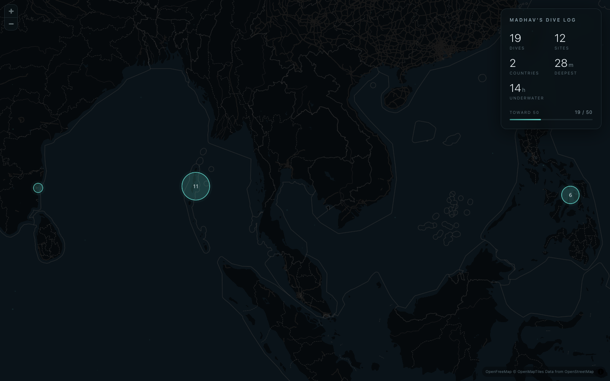

# Dive Map

A public, **map-first record of every dive you've done**. Your whole diving
history as a quiet, dark, full-screen map — one glowing marker per site, sized
by how often you've dived it — with a page for every dive underneath.

Built to be **forked**: point it at your own logbook, change one config line,
and it's yours. Fully static — it deploys to any static host and needs no
server, no database, and no API keys at runtime.

**🌊 Live demo:** [dives.madhavkauntia.com](https://dives.madhavkauntia.com) — the maintainer's own dive map, running this exact code.



## Features

- **Full-viewport map** (MapLibre GL + OpenFreeMap vector tiles — no API key,
  no billing). Dark ocean styling, labels stripped, recolored to a deep palette.
- **Markers sized by dive count**, with soft halos and a barely-there "breathing"
  animation. Nearby sites **cluster** and expand as you zoom.
- **Floating hover cards** — site name, region, dives-here / max-depth / avg-time.
- **A stats panel** — dives, sites, countries, deepest, hours underwater, and
  progress toward a goal you set.
- **A page per dive** — only the facts you recorded, optional markdown notes,
  prev/next navigation.
- **Atmosphere** — drifting "marine snow" over the map and a depth-darkening
  scroll on dive pages. All of it respects `prefers-reduced-motion`.

## Quick start

```bash
git clone <your-fork-url> ssi-dive-map && cd ssi-dive-map
npm install
npm run dev            # http://localhost:3000
```

The repo ships with the maintainer's dives in `content/` as working example
data. Replace it with your own (see **Your data** below) and:

1. Open [`site.config.ts`](site.config.ts) and set your name + dive goal:
   ```ts
   export const siteConfig = {
     owner: "Ada",     // → "Ada's Dive Map"
     diveGoal: 100,
   };
   ```
2. `npm run dev` and make it yours.

## Your data

The map and dive pages are built entirely from static JSON — the only inputs:

- `content/sites.json` — `site id → { name, slug, lat, lng, region, country }`
- `content/dives/NN-slug.json` — **one file per dive**

```ts
interface Dive {
  number: number; date: string; time: string | null; site: number;
  maxDepthM: number | null; avgDepthM: number | null; durationMin: number | null;
  waterTempC: number | null; visibilityM: number | null;
  verified: boolean; notes: string; // notes are markdown, authored by hand
}
```

You can write these by hand, or generate them from **SSI** (divessi.com):

```bash
cp .env.example .env.local     # add SSI_EMAIL / SSI_PASSWORD (gitignored)
npm run import                 # writes content/sites.json + content/dives/*.json
```

The importer ([`scripts/import-ssi.ts`](scripts/import-ssi.ts)) **never
overwrites an existing dive file**, so the `notes` you author by hand are safe
across refreshes. It reads credentials only from the environment — they never
enter the bundle or the repo. Diving a different logbook provider? Swap the
importer; everything downstream reads the JSON.

`lib/content.ts` loads these at build time and derives per-site aggregates
(dive count, deepest single dive, mean duration) and the global stats.

## Build & deploy

```bash
npm run build          # static export → ./out
```

`./out` is a plain static site — host it anywhere.

- **Netlify** — `netlify.toml` is included (publish dir `out/`, build
  `npm run build`). Connect the repo and it deploys on push.
- **Any static host** — Cloudflare Pages, GitHub Pages, S3, etc. Just serve
  `out/`.

### Keeping data fresh automatically (optional)

[`.github/workflows/refresh-dives.yml`](.github/workflows/refresh-dives.yml)
runs the importer on a schedule (and on demand), verifies the build, and
commits any new dives — which triggers your host's Git deploy. Add `SSI_EMAIL`
and `SSI_PASSWORD` as **repository secrets** to enable it. Notes are preserved;
if the import fails, nothing is pushed and the live site is untouched.

## Configuration

| Where | What |
|---|---|
| `site.config.ts` → `siteConfig` | Owner name, dive goal, source repo (corner watermark). |
| `site.config.ts` → `mapTheme` | Basemap style, marker/accent color, recolor palette, labels. |
| `content/` | Your sites + dives (the data). |
| `app/globals.css` `:root` / `tailwind.config.ts` | The UI palette (panels, text). |
| `components/MapView.tsx` | Marker sizing and clustering behavior. |

Swapping the map theme is a one-liner — e.g. `basemap: "positron"` for a light
map, or set `recolor: null` to keep a style's native colors:

```ts
export const mapTheme = {
  basemap: "dark",          // "dark" | "positron" | "liberty" | "bright" | style URL
  accent: "#5fd0c4",        // markers, halos, clusters
  recolor: { background: "#05090c", water: "#0a1319" }, // or null
  hideLabels: true,
};
```

## Tech

Next.js (App Router, `output: 'export'`) · TypeScript · Tailwind CSS ·
MapLibre GL JS · OpenFreeMap tiles. No analytics, no tracking, no external
fonts.

## Contributing

Issues and PRs welcome — bug fixes, new logbook importers, basemap themes,
accessibility, mobile polish. Keep it static (nothing may require a server at
runtime) and keep the quiet, dark aesthetic. Run `npm run build` before
opening a PR.

## License

[MIT](LICENSE) — fork it, dive with it, make it your own.
